# SwapCampus 数据库 ER 关系图

> 基于 `backend/apps/*/models.py` + `backend/core/models.py` 生成  
> 所有实体继承 `BaseModel`（id UUID PK, created_at, updated_at），图中省略以保持清晰

```mermaid
erDiagram
    %% ============================================
    %% 用户体系 (apps/users)
    %% ============================================

    User {
        uuid id PK "UUID主键"
        string username UK "学号(8-9位数字)"
        string password "Django哈希密码"
        string email "邮箱(可选)"
        string first_name "名"
        string last_name "姓"
        bool is_active "激活状态"
        bool is_staff "员工状态"
        bool is_superuser "超级管理员"
        datetime date_joined "注册时间"
        string nickname "昵称"
        image avatar "头像"
        int credit_score "信用分(初始100)"
        string campus "校区"
        text bio "个人简介"
        image student_id_card "学生证照片"
        enum status "pending/active/rejected/banned"
        text rejection_reason "拒绝原因"
    }

    CreditRecord {
        uuid id PK
        datetime created_at "创建时间"
        datetime updated_at "修改时间"
        int change "积分变化(+/-)"
        enum reason "order_complete/good_review/bad_review/cancel_order/violation/appeal_restore/initial/other"
        string description "详细说明"
        int score_after "变更后积分"
        uuid user_id FK "用户"
        uuid related_order_id FK "关联订单(可空)"
    }

    Notification {
        uuid id PK
        datetime created_at
        datetime updated_at
        enum type "order_update/new_order/new_message/credit_change/new_review/system"
        string title "标题"
        string content "内容"
        bool is_read "已读"
        uuid recipient_id FK "接收人"
        uuid related_order_id FK "关联订单(可空)"
        uuid related_product_id FK "关联商品(可空)"
    }

    %% ============================================
    %% 商品体系 (apps/products)
    %% ============================================

    Category {
        uuid id PK
        datetime created_at
        datetime updated_at
        string name UK "分类名称"
        string icon "图标"
        uuid parent_id FK "上级分类(自引用)"
        int sort_order "排序权重"
    }

    Tag {
        uuid id PK
        datetime created_at
        datetime updated_at
        string name UK "标签名称"
    }

    Product {
        uuid id PK
        datetime created_at
        datetime updated_at
        string title "商品标题"
        text description "商品描述"
        decimal price "售价"
        decimal original_price "原价(可空)"
        enum condition "new/like_new/used/old"
        enum status "pending/active/reserved/sold/hidden/banned"
        string campus "所在校区"
        int view_count "浏览次数"
        string reject_reason "驳回原因"
        uuid seller_id FK "卖家(User)"
        uuid category_id FK "所属分类(可空)"
    }

    ProductImage {
        uuid id PK
        datetime created_at
        datetime updated_at
        image image "图片文件"
        int sort_order "排序权重"
        bool is_cover "是否封面"
        uuid product_id FK "所属商品"
    }

    Favorite {
        uuid id PK
        datetime created_at
        datetime updated_at
        uuid user_id FK "用户"
        uuid product_id FK "商品"
    }

    Report {
        uuid id PK
        datetime created_at
        datetime updated_at
        enum reason "inappropriate/counterfeit/fraud/prohibited/other"
        text description "详细说明"
        enum status "pending/resolved/dismissed"
        string handled_note "处理备注"
        uuid reporter_id FK "举报人"
        uuid product_id FK "被举报商品"
        uuid handled_by_id FK "处理人(可空)"
    }

    Comment {
        uuid id PK
        datetime created_at
        datetime updated_at
        text content "评论内容"
        image image "评论图片(可空)"
        uuid product_id FK "所属商品"
        uuid author_id FK "评论者"
        uuid parent_id FK "回复对象(自引用,可空)"
    }

    %% ============================================
    %% 交易体系 (apps/transactions)
    %% ============================================

    Order {
        uuid id PK
        datetime created_at
        datetime updated_at
        enum status "pending/accepted/rejected/cancelled/face_confirm/completed"
        datetime meet_time "约定面交时间(可空)"
        string meet_location "面交地点"
        string cancel_reason "取消原因"
        datetime completed_at "完成时间(可空)"
        int buyer_review_count "买家评价次数"
        int seller_review_count "卖家评价次数"
        uuid buyer_id FK "买家"
        uuid seller_id FK "卖家"
        uuid product_id FK "商品"
        uuid cancel_by_id FK "取消人(可空)"
    }

    Review {
        uuid id PK
        datetime created_at
        datetime updated_at
        int rating "评分(1-5)"
        text content "评价内容"
        image image "评价图片(可空)"
        enum review_type "buyer_to_seller/seller_to_buyer"
        uuid order_id FK "关联订单"
        uuid reviewer_id FK "评价人"
        uuid reviewee_id FK "被评价人"
    }

    FaceConfirm {
        uuid id PK
        datetime created_at
        datetime updated_at
        string confirm_code "6位确认码"
        enum status "pending/confirmed/expired"
        datetime confirmed_at "确认时间(可空)"
        uuid order_id FK "关联订单(OneToOne)"
        uuid created_by_id FK "生成人(卖家)"
        uuid confirmed_by_id FK "确认人(买家,可空)"
    }

    %% ============================================
    %% 通讯体系 (apps/chat)
    %% ============================================

    Conversation {
        uuid id PK
        datetime created_at
        datetime updated_at
        string title "会话标题"
        uuid product_id FK "关联商品(可空)"
    }

    Message {
        uuid id PK
        datetime created_at
        datetime updated_at
        text content "消息内容"
        image image "图片(可空)"
        bool is_read "已读状态"
        uuid conversation_id FK "所属会话"
        uuid sender_id FK "发送者"
    }

    %% ============================================
    %% 实体关系
    %% ============================================

    %% ── 用户体系 ──
    User ||--o{ CreditRecord : "积分变更记录"
    User ||--o{ Notification : "接收通知"
    CreditRecord }o--o| Order : "关联订单(可空)"

    %% ── 商品体系 ──
    User ||--o{ Product : "发布"
    Category ||--o{ Category : "父子分类"
    Category ||--o{ Product : "归属分类"
    Product }o--o{ Tag : "标签(M2M)"
    Product ||--o{ ProductImage : "图片"
    User ||--o{ Favorite : "收藏"
    Product ||--o{ Favorite : "被收藏"
    User ||--o{ Report : "举报"
    Product ||--o{ Report : "被举报"
    User ||--o{ Report : "处理举报"
    User ||--o{ Comment : "评论"
    Product ||--o{ Comment : "商品评论"
    Comment ||--o{ Comment : "楼中楼回复"

    %% ── 交易体系 ──
    User ||--o{ Order : "购买(buyer)"
    User ||--o{ Order : "出售(seller)"
    Product ||--o{ Order : "交易订单"
    User ||--o{ Order : "取消(cancel_by)"
    Order ||--o{ Review : "互评"
    User ||--o{ Review : "评价(reviewer)"
    User ||--o{ Review : "被评(reviewee)"
    Order ||--|| FaceConfirm : "面交确认(1:1)"
    User ||--o{ FaceConfirm : "生成确认码(卖家)"
    User ||--o{ FaceConfirm : "确认(买家)"

    %% ── 通讯体系 ──
    User }o--o{ Conversation : "参与者(M2M)"
    Product ||--o{ Conversation : "咨询上下文"
    Conversation ||--o{ Message : "消息"
    User ||--o{ Message : "发送"

    %% ── 跨模块通知关联 ──
    Order ||--o{ Notification : "订单通知"
    Product ||--o{ Notification : "商品通知"
```



---

## 实体速查表

| # | 实体 | 表名 | 所属模块 | 核心关系 |
|---|------|------|----------|----------|
| 1 | **User** | users | M1 用户 | 中心实体，所有其他实体最终都关联到 User |
| 2 | **CreditRecord** | credit_records | M1 用户 | User 1:N，Order 0..1:N |
| 3 | **Notification** | notifications | M1 用户 | User 1:N（recipient），关联 Order/Product |
| 4 | **Category** | categories | M2 商品 | 自引用树形结构（两级分类） |
| 5 | **Tag** | tags | M2 商品 | Product M:N |
| 6 | **Product** | products | M2 商品 | User→seller, Category, Tag M:N |
| 7 | **ProductImage** | product_images | M2 商品 | Product 1:N |
| 8 | **Favorite** | favorites | M2 商品 | User+Product 联合唯一 |
| 9 | **Report** | reports | M2 商品 | reporter+product+handled_by 三向 User |
| 10 | **Comment** | comments | M2 商品 | Product 1:N, 自引用楼中楼 |
| 11 | **Order** | orders | M4 交易 | buyer+seller+cancel_by 三向 User, Product 1:N |
| 12 | **Review** | reviews | M4 交易 | Order 1:N, reviewer+reviewee 双向 User |
| 13 | **FaceConfirm** | face_confirms | M4 交易 | Order 1:1, created_by+confirmed_by 双向 User |
| 14 | **Conversation** | conversations | M5 通讯 | User M:N, Product 0..1:N |
| 15 | **Message** | messages | M5 通讯 | Conversation 1:N, sender→User |

## 关键设计决策

| 决策 | 实现 |
|------|------|
| **主键策略** | 全部实体 UUID（BaseModel），API 不暴露自增 ID |
| **用户标识** | username = 学号（8-9 位正则），全校唯一 |
| **信用分并发安全** | `select_for_update` 行锁 + `@transaction.atomic` |
| **会话去重** | 同一对用户+同一商品复用 Conversation |
| **订单状态机** | 6 状态 (pending→accepted/rejected/cancelled→face_confirm→completed) |
| **评价对称** | 买卖双方互评，各评一次 |
| **面交确认** | Order 1:1 FaceConfirm，卖家生成6位码，买家输入验证 |
| **软删除策略** | 外键 `on_delete=SET_NULL` 保留业务数据可追溯性 |
| **图片存储** | ImageField → 本地/MinIO，按年月分目录 |

## User 实体的多重角色

User 是系统的绝对中心节点，同时扮演以下角色：

```
User
├── 卖家 (seller)         → Product, Order(seller), FaceConfirm(created_by)
├── 买家 (buyer)          → Order(buyer), FaceConfirm(confirmed_by)
├── 评价人 (reviewer)     → Review
├── 被评价人 (reviewee)   → Review
├── 举报人 (reporter)     → Report
├── 处理人 (handled_by)   → Report
├── 取消人 (cancel_by)    → Order
├── 收藏者                 → Favorite
├── 评论者 (author)       → Comment
├── 会话参与者             → Conversation (M2M)
├── 消息发送者 (sender)   → Message
├── 通知接收人 (recipient) → Notification
└── 积分记录主体           → CreditRecord
```
