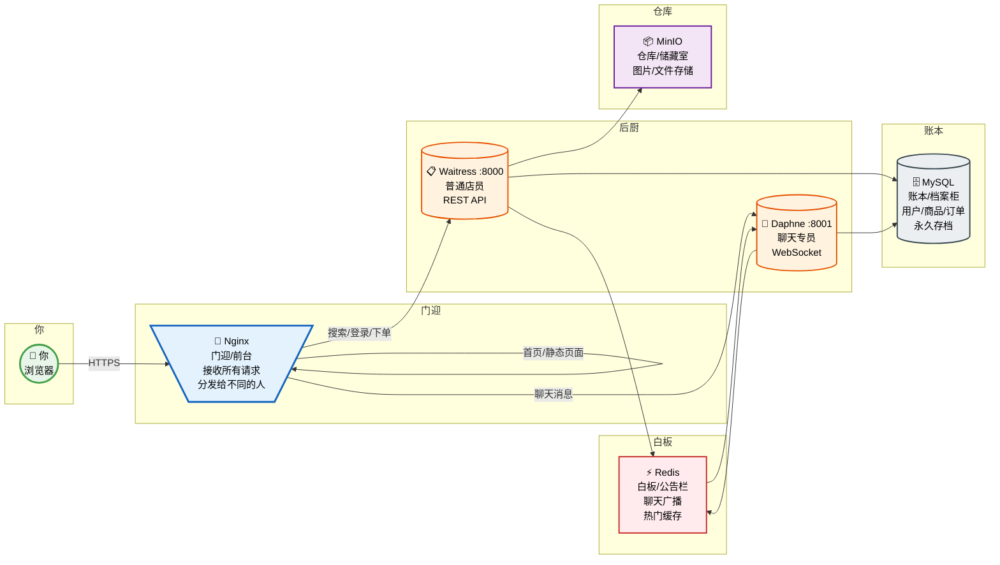
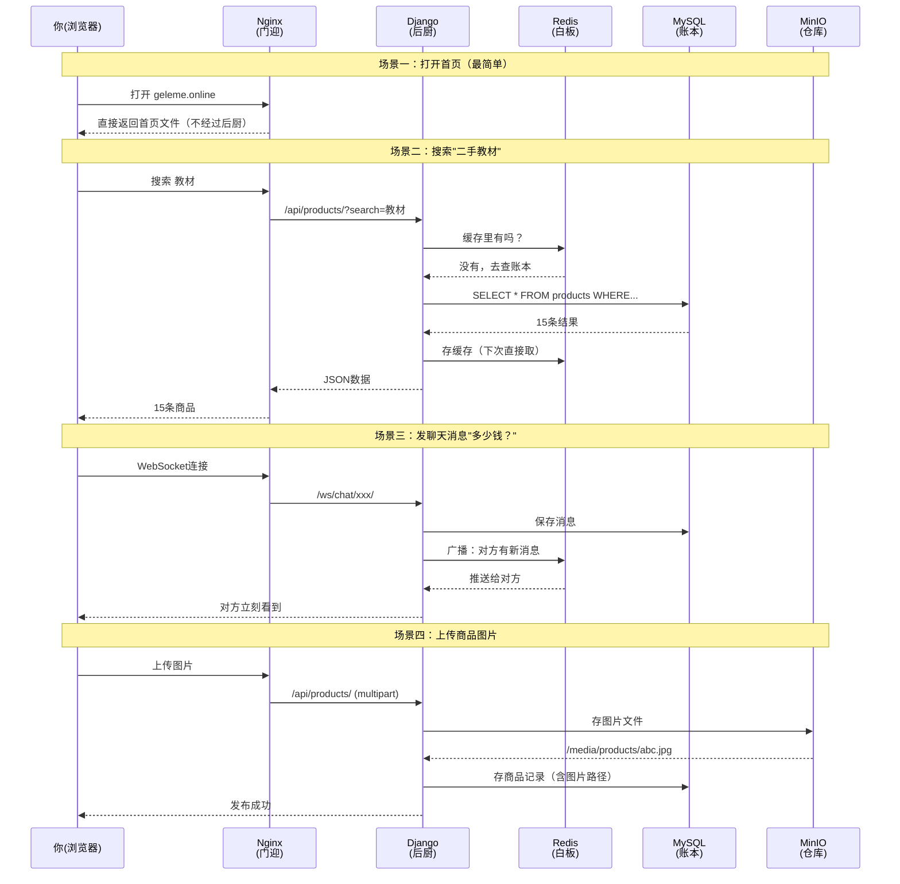

# SwapCampus 架构总览图

> 一行一个请求流程，从上到下读完就懂

```mermaid
graph LR
    subgraph 你
        A((🧑 你<br/>浏览器))
    end

    subgraph 门迎
        B[\🚪 Nginx<br/>门迎/前台<br/>接收所有请求<br/>分发给不同的人/]
    end

    subgraph 后厨
        C[(📋 Waitress :8000<br/>普通店员<br/>REST API)]
        D[(💬 Daphne :8001<br/>聊天专员<br/>WebSocket)]
    end

    subgraph 白板
        E[⚡ Redis<br/>白板/公告栏<br/>聊天广播<br/>热门缓存]
    end

    subgraph 账本
        F[(🗄️ MySQL<br/>账本/档案柜<br/>用户/商品/订单<br/>永久存档)]
    end

    subgraph 仓库
        G[📦 MinIO<br/>仓库/储藏室<br/>图片/文件存储]
    end

    A -->|HTTPS| B
    B -->|搜索/登录/下单| C
    B -->|聊天消息| D
    B -->|首页/静态页面| B
    C --> E
    C --> F
    C --> G
    D --> E
    D --> F
    E --> D

    style A fill:#e8f5e9,stroke:#43a047,stroke-width:3px,color:#000
    style B fill:#e3f2fd,stroke:#1565c0,stroke-width:3px,color:#000
    style C fill:#fff3e0,stroke:#e65100,stroke-width:2px,color:#000
    style D fill:#fff3e0,stroke:#e65100,stroke-width:2px,color:#000
    style E fill:#ffebee,stroke:#c62828,stroke-width:2px,color:#000
    style F fill:#eceff1,stroke:#37474f,stroke-width:2px,color:#000
    style G fill:#f3e5f5,stroke:#6a1b9a,stroke-width:2px,color:#000
```

---

## 一次访问的完整路径

```mermaid
sequenceDiagram
    participant 🧑 as 你(浏览器)
    participant 🚪 as Nginx<br/>(门迎)
    participant 🍳 as Django<br/>(后厨)
    participant ⚡ as Redis<br/>(白板)
    participant 🗄️ as MySQL<br/>(账本)
    participant 📦 as MinIO<br/>(仓库)

    Note over 🧑,📦: 场景一：打开首页（最简单）
    🧑->>🚪: 打开 geleme.online
    🚪-->>🧑: 直接返回首页文件（不经过后厨）

    Note over 🧑,📦: 场景二：搜索"二手教材"
    🧑->>🚪: 搜索 教材
    🚪->>🍳: /api/products/?search=教材
    🍳->>⚡: 缓存里有吗？
    ⚡-->>🍳: 没有，去查账本
    🍳->>🗄️: SELECT * FROM products WHERE...
    🗄️-->>🍳: 15条结果
    🍳->>⚡: 存缓存（下次直接取）
    🍳-->>🚪: JSON数据
    🚪-->>🧑: 15条商品

    Note over 🧑,📦: 场景三：发聊天消息"多少钱？"
    🧑->>🚪: WebSocket连接
    🚪->>🍳: /ws/chat/xxx/
    🍳->>🗄️: 保存消息
    🍳->>⚡: 广播：对方有新消息
    ⚡-->>🍳: 推送给对方
    🍳-->>🧑: 对方立刻看到

    Note over 🧑,📦: 场景四：上传商品图片
    🧑->>🚪: 上传图片
    🚪->>🍳: /api/products/ (multipart)
    🍳->>📦: 存图片文件
    📦-->>🍳: /media/products/abc.jpg
    🍳->>🗄️: 存商品记录（含图片路径）
    🍳-->>🧑: 发布成功
```
