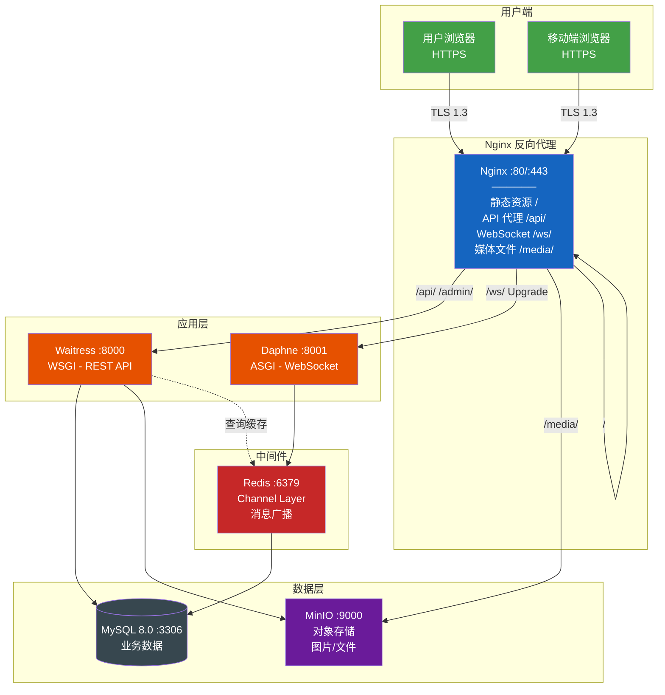

# SwapCampus 部署架构图

> 可直接截图用于 D-10 答辩 PPT【部署架构图】占位

```mermaid
graph TB
    subgraph 用户端
        A[用户浏览器<br/>HTTPS]
        B[移动端浏览器<br/>HTTPS]
    end

    subgraph Nginx 反向代理
        C[Nginx :80/:443<br/>──────<br/>静态资源 /<br/>API 代理 /api/<br/>WebSocket /ws/<br/>媒体文件 /media/]
    end

    subgraph 应用层
        D[Waitress :8000<br/>WSGI - REST API]
        E[Daphne :8001<br/>ASGI - WebSocket]
    end

    subgraph 中间件
        F[Redis :6379<br/>Channel Layer<br/>消息广播]
    end

    subgraph 数据层
        G[(MySQL 8.0 :3306<br/>业务数据)]
        H[MinIO :9000<br/>对象存储<br/>图片/文件]
    end

    A -->|TLS 1.3| C
    B -->|TLS 1.3| C
    C -->|/api/ /admin/| D
    C -->|/ws/ Upgrade| E
    C -->|/media/| H
    C -->|/| C
    D --> G
    D --> H
    E --> F
    F --> G
    D -.->|查询缓存| F

    style A fill:#43a047,color:#fff
    style B fill:#43a047,color:#fff
    style C fill:#1565c0,color:#fff
    style D fill:#e65100,color:#fff
    style E fill:#e65100,color:#fff
    style F fill:#c62828,color:#fff
    style G fill:#37474f,color:#fff
    style H fill:#6a1b9a,color:#fff
```
